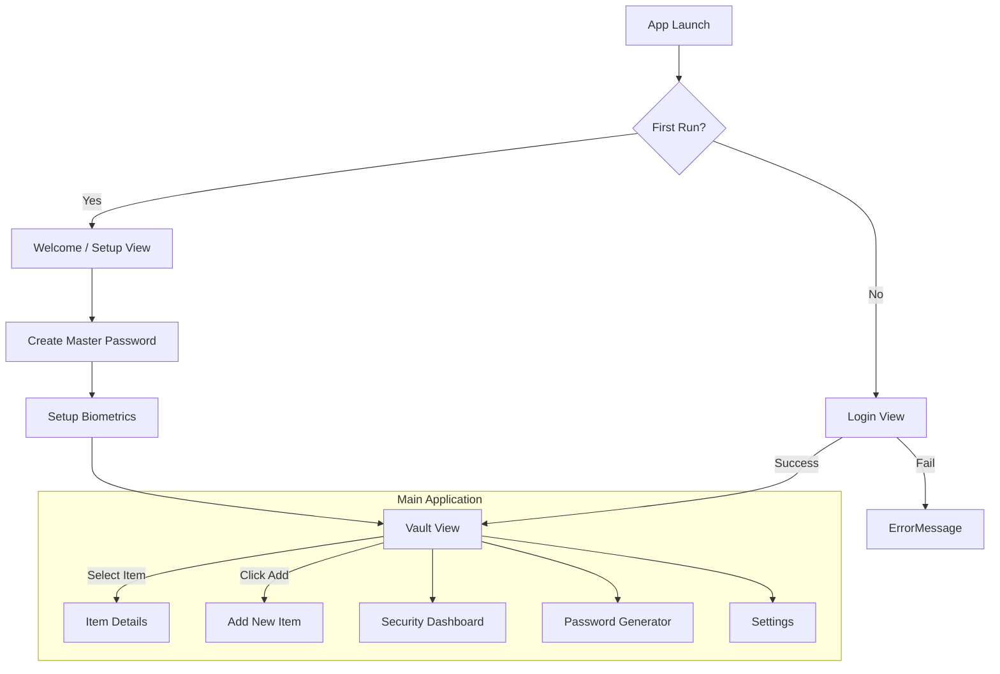

# UI Design & Flow Document: Premium Password Manager

## 1. Design Philosophy
*   **Aesthetic**: "Premium Modern". Dark mode by default, utilizing a slate/zinc color palette with high-contrast accent colors (e.g., Electric Blue or Emerald Green).
*   **Framework**: Tailwind CSS.
*   **Responsiveness**: Fully responsive layout.
    *   **Desktop**: Sidebar navigation + Main Content Pane + Detail Pane (3-column layout).
    *   **Mobile**: Bottom navigation bar + Single active view (1-column layout).

## 2. User Flow Diagram

## 3. Screen Specifications

### 3.1 Login / Unlock View (`LoginView`)
*   **Layout**: Centered card on a blurred background.
*   **Elements**:
    *   Logo / App Icon (Animated).
    *   Input: Master Password (floating label).
    *   Button: "Unlock Vault".
    *   Button: "Unlock with Biometrics" (Fingerprint icon) - visible if enabled.
    *   Link: "Forgot Password? (Reset Vault)".

### 3.2 Main Vault View (`VaultView`)
*   **Sidebar (Desktop) / Drawer (Mobile)**:
    *   Navigation: All Items, Favorites, Shared.
    *   Categories: Logins, Secure Notes, Credit Cards, Identities.
    *   Tags: #Work, #Personal, #Finance.
*   **List Pane**:
    *   Search Bar: Sticky top, real-time filtering.
    *   List Items: Icon (Favicon), Title, Username, copy buttons (hidden by default, visible on hover).
*   **Detail Pane** (Desktop only, separate screen on Mobile):
    *   Header: Big Icon, Title, "Edit" & "Share" buttons.
    *   Fields: Username/Email, Password (masked, with eye toggle & quality meter bar), strict URL matching rules.
    *   History: "Last used" timestamp.

### 3.3 Security Dashboard (`SecurityDashboard`)
*   **Visuals**: Large circular "Health Score" chart (Green/Yellow/Red).
*   **Actionable Lists**:
    *   "Compromised Passwords" (Breach report).
    *   "Reused Passwords".
    *   "Weak Passwords".
*   **Interactions**: Clicking an item navigates directly to the Edit screen for that item.

### 3.4 Password Generator (`GeneratorView`)
*   **Design**: Clean, tool-focused details.
*   **Output**: Large text area with the generated password.
*   **Controls**:
    *   Slider: Length (8-128 chars).
    *   Toggles: A-Z, a-z, 0-9, !@# (Special Chars).
    *   Type buttons: "Password" vs "Passphrase" (correct horse battery staple).
*   **History**: A list of recently generated passwords (cleared on lock).

### 3.5 Settings (`SettingsView`)
*   **Sections**:
    *   **Account**: Change Master Password, Export Data, Delete Account.
    *   **Security**: Auto-lock timeout, Biometrics toggle, 2FA setup.
    *   **Appearance**: Theme toggle (Dark/Light/System), Compact View.
    *   **Sync**: Cloud Provider selection (Dropbox, Google Drive, WebDAV).

## 4. Interaction Details
*   **Clipboard**: Auto-clear clipboard after 60 seconds (toast notification with countdown).
*   **Animations**:
    *   Page transitions: Small `fade-in` + `slide-up`.
    *   List items: Layout animations when filtering (Framer Motion or CSS transitions).
